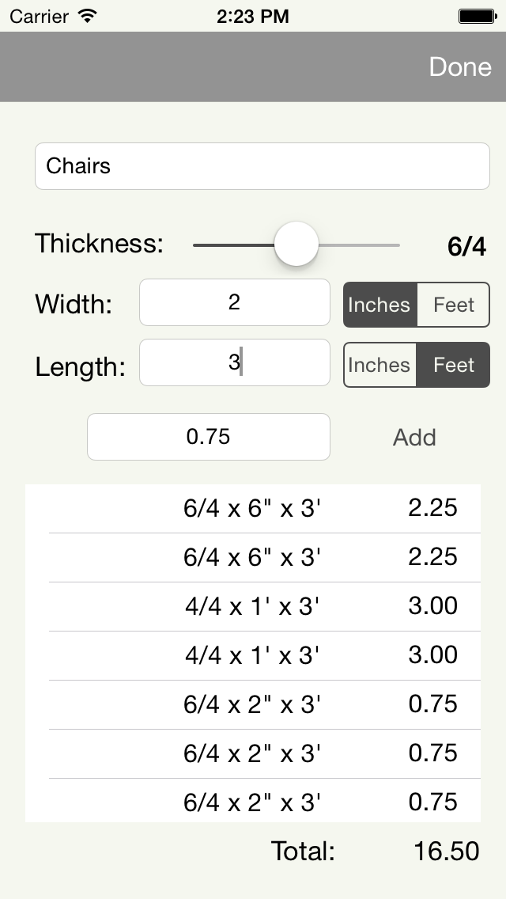

## Board Foot Calculator
### A simple iOS app to keep track of the raw lumber needs for each of your woodworking projects. 

## Jobs

## Measurements

## Roadmap
####v1.0
- Add ability to set quantity
- Add ability to set cost 
- Add % waste calculation
- Add quantity specifier
- Add Deducting view
- Add CloudKit backend
- Add DropBox backend
- Connect lumber species database 

